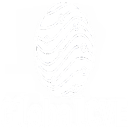

  

<h3 align="center"><em>Global threats. Unified insights.</em></h3>

# 🌍 GlobalCVE

GlobalCVE is an open-source platform designed to unify vulnerability intelligence from across the web. Instead of jumping between fragmented sources, researchers and developers can search, compare, and track CVEs in one place. Many existing databases miss listings that others include — for example, CVEs found on one site may be absent from another. GlobalCVE bridges those gaps, helping the community stay informed and ahead of emerging threats.

---

## 🚀 Project Goals
- Aggregate CVE data from multiple national and international sources
- Normalize and enrich vulnerability data for global comparison
- Provide a clean, searchable interface for exploring CVEs
- Offer open APIs for developers and security tools
- Build a community-driven platform for global cybersecurity awareness

---

## 🌐 CVE Sources We Plan to Include
- 🇺🇸 NVD (National Vulnerability Database)
- 🌐 MITRE CVE List
- 🇨🇳 CNNVD (China National Vulnerability Database)
- 🇯🇵 JVN (Japan Vulnerability Notes)
- 🇫🇷 CERT-FR (France)
- 🇷🇺 Russian cybersecurity feeds (TBD)
- 🧠 Additional sources: Vulners, CIRCL, ExploitDB

---

## 🛠️ Tech Stack (Planned)
- **Frontend**: Next.js (React)
- **Backend**: Node.js + Express (with Python for data ingestion)
- **Database**: PostgreSQL or MongoDB
- **Hosting**: Vercel / Netlify / Cloud provider

---

## 📦 Getting Started
Coming soon! We’re currently setting up the project structure and landing page. Stay tuned!

---

## 🤝 Contributing
We welcome contributions from developers, researchers, and translators. Issue templates and contribution guidelines will be added soon.

---

## 📫 Contact
Email: [globalcve@gmail.com](mailto:globalcve@gmail.com)  
GitHub: [github.com/GlobalCVE](https://github.com/GlobalCVE)
